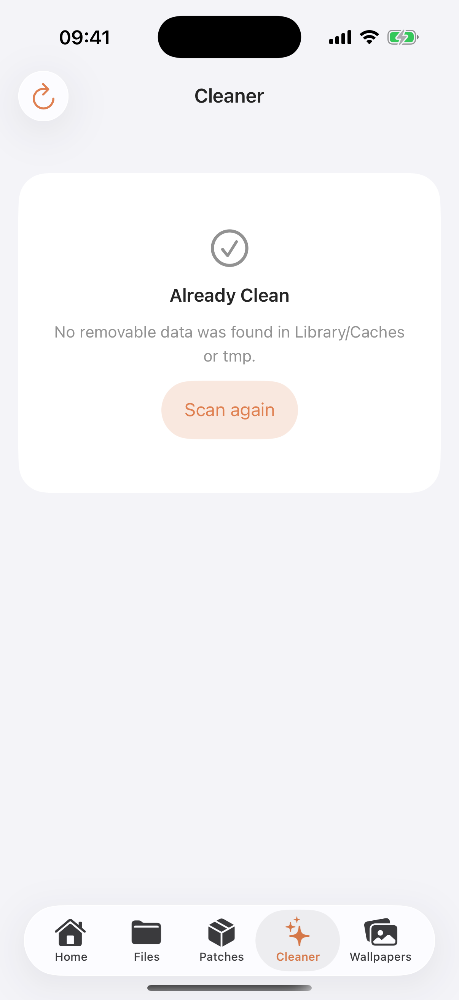

  

<h1 align="center">3105</h1>

  Trình quản lý dữ liệu ứng dụng, patch theo bundle, dọn dẹp giới hạn và hình nền PosterBoard dành cho iOS.

  
  
  

<a href="README.md">English</a> · <a href="#giấy-phép">Giấy phép</a>

> [!WARNING]
> 3105 đang ở giai đoạn beta. Chỉ sử dụng trên thiết bị và dữ liệu thuộc quyền sở hữu của bạn, đồng thời luôn sao lưu trước khi thay đổi tệp hệ thống hoặc dữ liệu ứng dụng.

## Giao diện

  
  &nbsp;
  
  &nbsp;
  

## Tính năng chính

- Duyệt dữ liệu ứng dụng theo **bundle identifier**, không phụ thuộc UUID container của từng máy.
- Trình quản lý tệp có tìm kiếm, nhập nhiều tệp, đổi tên, xóa, tạo tệp/thư mục và xử lý trùng tên.
- Tạo và nhập dự án patch `.3105`, hỗ trợ nhiều quy tắc, tệp/thư mục và mật khẩu tùy chọn.
- Dọn dẹp giới hạn trong `Library/Caches` và `tmp`, luôn hiển thị cảnh báo trước khi xóa.
- Nhập gói hình nền `.tendies`, xác thực payload và chỉ reset nội dung do 3105 cài đặt.
- 3105 không cài jailbreak, bootstrap hay daemon thường trú và không inject mã vào ứng dụng bên thứ ba. Do ứng dụng vẫn dùng khai thác thiết bị và có thể sửa dữ liệu app, không thể bảo đảm vượt qua mọi cơ chế kiểm tra tính toàn vẹn hoặc phát hiện jailbreak.
- Hỗ trợ tiếng Anh, tiếng Việt và tiếng Trung giản thể.

## Phiên bản iOS đã xác minh

| Hệ thống | Phiên bản/build |
| --- | --- |
| iOS 26 | 26.0 đến 26.6.1 |
| iOS 27 beta 1 | `24A5355q` |
| iOS 27 beta 2 | `24A5370h` |
| iOS 27 beta 3 | `24A5380h` |
| iOS 27 beta 4 | `24A5390f` |

Những build không có trong bảng sẽ được đánh dấu là không hỗ trợ.

## Lưu ý cài đặt

- Các chức năng trên thiết bị yêu cầu ứng dụng được ký bằng **chứng chỉ doanh nghiệp**.
- Không hỗ trợ SideStore, AltStore, 3uTools hoặc LiveContainer.
- Bundle ID `com.apple.mobile.MobileHouseArrest` được giữ có chủ đích cho luồng MHA-C2.
- Cây mã nguồn không chứa chứng chỉ, provisioning profile, ứng dụng đã ký hoặc IPA; phần Release có thể cung cấp IPA unsigned.

## Tác giả và ghi công

3105 được phát triển và thiết kế bởi [YangJiii](https://x.com/duongduong0908). Xem [THIRD_PARTY_NOTICES.md](THIRD_PARTY_NOTICES.md) để biết các dự án và nhà phát triển nền tảng đã được sử dụng/tham khảo.

## Giấy phép

Phần mã gốc của 3105 được phát hành theo [GNU General Public License v3.0](LICENSE). Thành phần của bên thứ ba vẫn tuân theo bản quyền và điều khoản của dự án nguồn tương ứng; xem [THIRD_PARTY_NOTICES.md](THIRD_PARTY_NOTICES.md).
